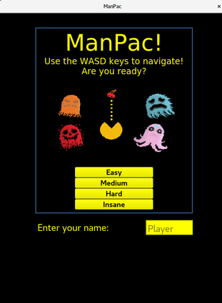

# ManPac

University project to develop a maze navigator similar to the famous PacMan. 

Written in C++ and Qt.

The game includes 4 difficulty modes and custom sound effects.

There is even an optional Rave mode :musical_note:: 

